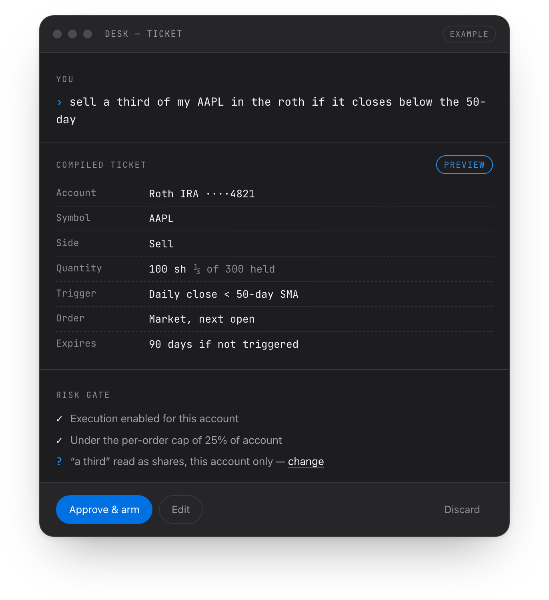
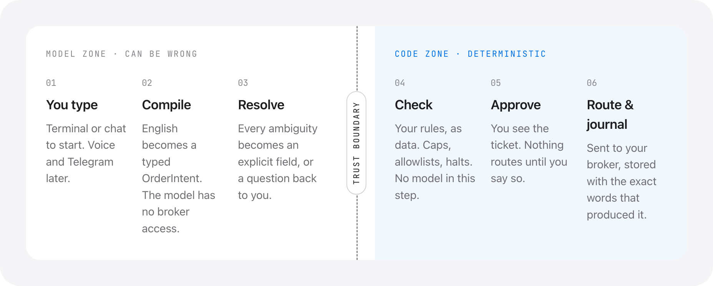

<div align="center">

<picture>
  <source media="(prefers-color-scheme: dark)" srcset="docs/assets/lockup-dark.svg">
  
</picture>

### Trade in plain English, on the broker you already have.

A self-hosted agent that turns what you type into an order ticket, checks it against your own rules,<br>
and routes it to your own brokerage — only after you approve it.

[](#roadmap)
[](#faq)
[](#brokers)
[](#license)

[How it works](#how-it-works) · [Security](SECURITY.md) · [Architecture](docs/architecture.md) · [Brokers](#brokers) · [Roadmap](#roadmap) · [FAQ](#faq)

<br>

<picture>
  <source media="(prefers-color-scheme: dark)" srcset="docs/assets/readme-ticket-dark.png">
  
</picture>

</div>

> [!IMPORTANT]
> **Design phase — there is no runnable code yet.** The architecture, schema and threat model are published before the implementation, on purpose: software that can place trades should be reviewable before it can touch an account.

## The problem

**AI agents can trade now — if you move your money.** Brokerages started shipping agents you instruct in plain English. They run inside that broker, on balances held there.

**Self-hosted agents can do anything — which is the problem.** General-purpose agents that run on your own machine spread fast in 2026, and so did what went wrong with them: API keys in plaintext, poisoned skill marketplaces, instructions hidden inside the pages they read. Point that at a brokerage account and it stops being a data problem.

**Most self-directed money isn't moving.** It sits at brokers people have used for decades, in accounts they won't transfer for a feature.

Snø Desk is the narrow tool for that gap: one job — turning instructions into orders at *your* broker — designed on the assumption that it will be attacked.

## What it does

You write what you want. Snø Desk turns it into a ticket with every field explicit, and waits.

| You type | It becomes |
|---|---|
| `sell a third of my AAPL in the roth if it closes below the 50-day` | Conditional sell · 100 sh · Roth · triggers on a daily close under the 50-day SMA |
| `buy $2,000 of VTI in the roth on the first of every month` | Recurring buy · notional · armed agent with a per-fire cap |
| `if SPY closes below its 200-day, put 20% of the trading account into SGOV` | Conditional buy · sized at trigger · starts paused |
| `tell me if anything I own closes 8% below cost — don't sell` | Alert-only agent · cannot place orders |

Anything ambiguous — *which* account, shares or dollars, market or limit — becomes an explicit field on the ticket, or a question back to you. Nothing is inferred silently.

<sub>Illustrative examples.</sub>

## How it works

<div align="center">
<picture>
  <source media="(prefers-color-scheme: dark)" srcset="docs/assets/readme-pipe-dark.png">
  
</picture>
</div>

| # | Step | Done by | What happens |
|---|---|---|---|
| 1 | You type | You | Terminal or chat. Voice and Telegram later. |
| 2 | Compile | Model | English becomes a typed `OrderIntent`. The model has no broker access. |
| 3 | Resolve | Model + you | Every ambiguity becomes an explicit field, or a question back to you. |
| 4 | Check | Code | Your rules, as data: caps, allowlists, halts. No model in this step. |
| 5 | Approve | You | You see the ticket. Nothing routes until you say so. |
| 6 | Route & journal | Code | Sent to your broker, stored with the exact words that produced it. |

**The trust boundary is the whole design.** A language model is good at turning a sentence into structure and bad at being trusted with money, so it only ever produces a *proposal*. Everything past the boundary is ordinary deterministic code, and `place()` accepts only an `ApprovedTicket` — a type that can be constructed in exactly one place.

Detail: [`docs/architecture.md`](docs/architecture.md)

## Security model

| Rule | Why it matters |
|---|---|
| **The model never holds the pen.** | It emits a typed intent. Code validates it and places it. |
| **Two channels.** | Text the agent *reads* — news, filings, email, web pages — can never create an order. Only you can. This is the prompt-injection defense, enforced in types rather than requested in a prompt. |
| **Keys stay in the OS keychain.** | Never in a config file, log, backup or the journal. |
| **Read-only until you say otherwise.** | Execution is a per-account switch, off by default. |
| **Nothing arms itself.** | New and imported agents start paused. `desk halt` stops everything. |

Eight threats, their failure modes, and five release invariants: [`SECURITY.md`](SECURITY.md)

## Brokers

| Broker | Status | Notes |
|---|---|---|
| Charles Schwab | **First adapter** | Read-only in v0.1 · trading in v0.2 |
| Interactive Brokers | Planned | v0.3 |
| Alpaca | Planned | v0.3 |
| Tradier | Planned | After v0.3 |
| tastytrade | Planned | After v0.3 |
| Fidelity | Not possible | No retail trading API |
| Vanguard | Not possible | No retail trading API |

Adapters talk to each broker's own API. Snø Desk will not route your credentials through a third-party aggregator to widen coverage — that puts someone else between you and your account, which is the thing this project exists to avoid.

## Agents

Standing instructions compile to the same typed ticket and pass the same risk gate.

| State | What it does |
|---|---|
| `paused` | Nothing. Every new or imported agent starts here. |
| `preview` | Evaluates its trigger and journals what it *would* have done. Routes nothing. |
| `armed` | Produces tickets through the full pipeline, inside its caps. |

```console
$ desk agent new "if SPY closes below its 200-day, put 20% of the trading account into SGOV"

  compiled   a2 · buy · SGOV · notional
  sizing     20% of Trading ····7730, recomputed at trigger
  trigger    SPY daily close < 200-day SMA
  resolved   "200-day" → simple moving average, 200 sessions
  state      PAUSED

  desk agent preview a2   see what it would have done
  desk agent arm a2       start acting, inside your caps
```

<sub>Planned CLI. Illustrative only.</sub>

Triggers evaluate while your machine is awake — a real cost of self-hosting. Where a broker supports native conditional orders, simple triggers can live at the broker instead.

## Repository

```
.
├── README.md
├── SECURITY.md            threat model · release invariants
└── docs/
    ├── architecture.md    trust boundary · OrderIntent · adapters · agents
    ├── index.html         project website, served from /docs
    └── assets/            logos and README images
```

## Roadmap

- [ ] **Design** — architecture, `OrderIntent` schema, adapter interface, threat model *(in progress)*
- [ ] **v0.1 — Schwab, read-only.** Sync, mark and reconcile. The compiler produces tickets; nothing routes.
- [ ] **v0.2 — Schwab, trading.** Execution behind a per-account switch, with the risk gate and approval.
- [ ] **v0.3 — IBKR and Alpaca.** Adapters two and three; the interface proves itself or gets rewritten.
- [ ] **v0.4 — Agents.** Standing instructions with the `paused → preview → armed` lifecycle.

## FAQ

<details>
<summary><strong>Is Snø Desk a broker?</strong></summary><br>

No. Your money stays at your own brokerage. Snø Desk is software on your machine that sends instructions to that broker's API, the way a desktop trading platform does. It holds no funds and takes no custody.
</details>

<details>
<summary><strong>Does it tell me what to buy?</strong></summary><br>

No. It ships no signals, no watchlists, no strategies. You bring the decisions; it builds the machine that carries them out and keeps you honest about what you actually instructed.
</details>

<details>
<summary><strong>Why self-hosted instead of a hosted app?</strong></summary><br>

Because a hosted version would have to hold your broker credentials. That single design choice is what creates most of the risk in this category — a breach of the service becomes a breach of every connected account. Running locally means the credentials never leave your machine and there's nothing central to steal.
</details>

<details>
<summary><strong>Why not use an aggregator to support more brokers?</strong></summary><br>

Aggregators would widen broker coverage considerably — but they work by holding your tokens, which reintroduces exactly the third party this project exists to remove. Direct adapters mean fewer brokers and no middleman. That trade is deliberate.
</details>

<details>
<summary><strong>Which AI model does it use?</strong></summary><br>

Your own — an API key you supply, or a local model. Still an open question: the minimum model capable of compiling instructions reliably. The model only ever produces a proposal, so a weaker one degrades into worse suggestions, never into a wrong order.
</details>

<details>
<summary><strong>What happens when my computer is asleep?</strong></summary><br>

Triggers don't evaluate. That's an honest cost of self-hosting. Where a broker supports native conditional orders, simple triggers can be placed at the broker so they survive independently; complex ones need the machine awake, and the agent tells you which kind you have.
</details>

<details>
<summary><strong>Can I use it today?</strong></summary><br>

No. This is the design, not an implementation. v0.1 is read-only Schwab — sync, mark and reconcile, with the compiler producing tickets that route nowhere.
</details>

<details>
<summary><strong>Why publish a design with no code?</strong></summary><br>

Because the security model is the product. A threat model published after an implementation is a description of what got built; published first, it's a commitment that can be argued with while changing it is still cheap.
</details>

<details>
<summary><strong>How can I help?</strong></summary><br>

Attack the threat model. Once this repo is public, the most valuable contribution is an issue explaining how the two-channel rule or the risk gate could be bypassed.
</details>

## License

Not yet chosen. Until a license file is added, all rights are reserved. A license will be selected before this repository is made public.

---

<sub>Snø Desk is software you run yourself. It is not a broker-dealer or investment adviser, holds no funds or credentials on anyone's behalf, and provides no investment advice or recommendations. Trading involves risk of loss, and you are responsible for every order you approve. Broker names identify compatibility only and imply no endorsement.</sub>
